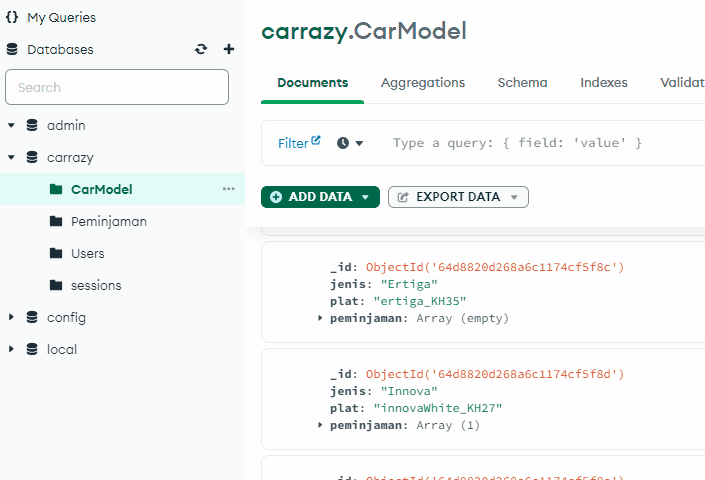

# Carrazy
#react #nodejs #expressjs #mongodb

carrazy is a simple vehicles fleet management web app that lets its users issue appointment to use any companies vehicle for work-related purposes, request will be reviewed by the management admin authorized to modify, approve or reject based on the availability of intended assigned vehicle.


### Setup
requirements :
1. [mongodb](https://www.mongodb.com/try/download/community)
2. [nodejs](https://nodejs.org/en)
3. (optional) [Git](https://git-scm.com/downloads) 


## run server locally

1. download the compressed project file and *carModelExample.json* from [releases](https://github.com/xvrx/carrazy/releases/tag/%23fleet) 
2. using command prompt, navigate to folder the directory and install all necessary modules (example :  `cd D:\folders\<projectdirectory>`)
```bash
npm install
```

3. open mongodb, create a database 'carrazy'

5. navigate to project directory and run :
```bash
npm start
```
6. after running the server, collections will be automatically added into the database


7. close the command prompt to shut down the server

7. import *carModelExample.json*  to the carModel Collection



8. add at least one admin or more users into Users collection based on the following structure (contains nama,nip,seksi,pws,role), there are only 2 roles : "admin" and "user"


9. open `config.js` in the directory project :


- `DB URL` = the server in which mongodb runs
- `CRON SCHEDULE` = the time in which the app update the status of each active records in the database (ongoing / waiting / approved)
	 the app updates every : 
	- 1 -5 is monday to friday
	- 06 is the hour
	- 26 is the minutes
	- so it's every 6 past 26 from monday to friday
- `USE_BUILD_DIRECTORY` = if true, the server will serve the front end in `build` folder instead of expecting request from other front-end server (e.g : react)


10. with command prompt, navigate to the project directory again and start the server

```bash
npm start
```

11. open the browser,
	- access the server :
		- via localhost : `http://localhost:<port as in config.js>` or `http://127.0.0.1:port/`
		- via ip : `http://<yourDeviceIP>:<port>`

12. login with credentials you that you have stored in Users collection (step 9)

### add new car model

> car model collections in the db do the job of tracking of all active records so they don't overlap.

to add new car model :
1. add new image model for the car (it's recommended that the image width and height and the file size are relatively similar to that of examples.)
2. in mongodb, into the carModel collection, insert a record for the new model (jenis, plat & peminjaman)


## + run the server as a service (for windows only)

after successful local server setup, you can install the process as a service (instead of showing up a terminal, the process run in the background) 

1. open command prompt, install a package called `node-windows` globally
```bash
npm i node-windows -g
```
2. create a file outside of the project directory

	- lets name it	`runAsService.js`, modify the script location to the `main.js` in the project directory location

```javascript
const Service = require('node-windows').Service;

const svc = new Service({
    name: 'Carrazy', // name of the service
    description: 'Fleet management and mental disorder.', // whatever
    script: 'D:\\pinjambrok\\srv\\main.js', // address to your project directory
  });

  svc.on('install', () => {
    svc.start();
  });
  svc.install();
```

save the file

- open cmd as administrator, navigate to `runAsService.js` directory and run
```bash
node runAsService.js install
```
- this will create a new folder inside your project directory called "daemon", check for any error in carrazy.err.log, if there's no error inside the log, the service is running in the background


- open run (windows + R), type services.msc or just search for 'services' in windows start menu
- in services, find for "carrazy" (name of service in step 2)
- set Startup type to automatic and click start


> server will no longer show the terminal as it runs in the background. 
> you can still run the local server in the project folder using `npm start`

open your browser and access the server as in step 11


